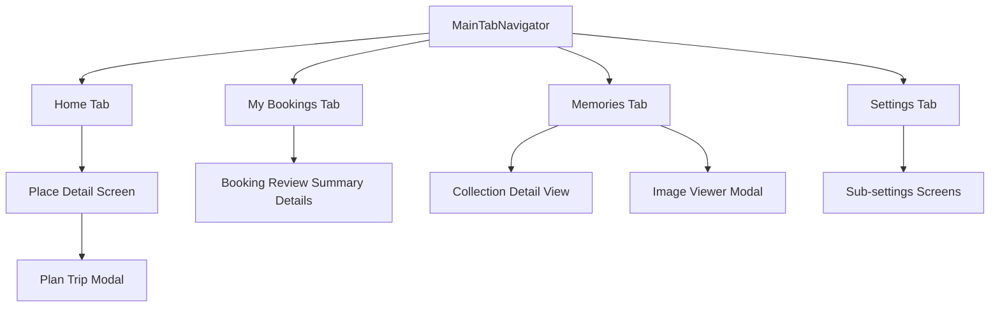

# TrackMate: Feature & Architecture Documentation

Welcome to the **TrackMate** Feature & Architecture Documentation. This guide details the screen layouts, theme system, design patterns, and core code structures that power the TrackMate mobile application.

---

## 1. Application Layout & Screens

TrackMate is a travel planning and memory collection app built in React Native. The core user flow revolves around discovering places, planning trips, uploading memories (photos), managing bookings, and configuring settings.

### 1.1 Home Tab (`Home`)
* **Header ([HomeHeader.jsx](file:///c:/trackMate/src/screens/home/components/HomeHeader.jsx)):** Displays user profile avatar, centered "TrackMate" title, and a notification bell with an active unread count badge.
* **Promo Carousel ([PromoCarousel.jsx](file:///c:/trackMate/src/screens/home/components/PromoCarousel.jsx)):** Shows dynamic sliding promotional cards. Tapping a card opens a modal alert with coupon details (`SUMMER20`, `STAY15`, `WILDTOUR`).
* **Content:** Displays popular travel destinations, custom filters, and category tabs.

### 1.2 Place Detail Screen (`PlaceDetails` - [index.jsx](file:///c:/trackMate/src/screens/place-detail/index.jsx))
* **Hero Image:** Parallax header showcasing the destination.
* **Details Tabs:** Dynamic tabs showing "Overview", "Sub Locations", and "Reviews".
* **Sticky Bottom CTA:** Redesigned premium action pill button ("Plan Trip" in brand orange `#FF6B35`) next to the estimated total cost block.
* **Plan Trip Modal:** Interactive form overlay triggered by the CTA to input trip name, start date, and end date.

### 1.3 Memories Tab (`ImageUploadPage` - [index.jsx](file:///c:/trackMate/src/screens/ImageUploadPage/index.jsx))
* **Collections View:** Displays past travel albums/collections card decks.
* **Image Upload:** Camera and file-picker integrations to attach photos directly to active trips or custom collections.
* **Image Viewer Modal ([ImageViewerModal.styles.js](file:///c:/trackMate/src/screens/ImageUploadPage/components/ImageViewerModal/ImageViewerModal.styles.js)):** Transparent overlay allowing users to pinch, swipe, and read captions of uploaded trip images.

### 1.4 My Bookings Tab (`Dashboard` - [index.jsx](file:///c:/trackMate/src/screens/dashboard/index.jsx))
* **Trips List:** Displays upcoming, active, completed, or cancelled trips.
* **Review Summary Details ([details.jsx](file:///c:/trackMate/src/screens/dashboard/details.jsx)):** Provides an overview invoice of the booking (check-in, check-out dates, guest counts, room allocations, cost breakdowns, and cancel options).

### 1.5 Settings Tab (`SettingsScreen` - [index.jsx](file:///c:/trackMate/src/screens/profile/index.jsx))
* **Profile Header:** Displays name, email, and avatar initial block.
* **Options List:** Navigate to individual sub-settings sheets for:
  * Personal Info & Account Security.
  * Notifications, Appearance, and Language.
  * Billing & Subscription, Payment Methods, and Rate Us.

---

## 2. Design System & Theme

TrackMate utilizes a cohesive design system exported from [theme.js](file:///c:/trackMate/src/theme/theme.js). 

### 2.1 Theme Mappings
All components use the `useTheme` context hook to adapt styles to Light/Dark mode dynamically:
* **Brand Colors:**
  * **Primary (Accent Violet):** Light: `#6C63FF` | Dark: `#8B84FF`
  * **Warm Active (Orange/Coral):** `#FF6B35` (Used for primary screen CTAs, tab-bar active indicators, switches, and sub-settings item accents).
  * **Backgrounds:** Light: `#FFFFFF` / `#F0F0F5` | Dark: `#13132B` / `#242444`.

### 2.2 Typography Tokens
The application relies on **Lexend** as its official font family, configured in `Tokens.typography.families`:
* **`light`**: `'Lexend-Light'`
* **`regular`**: `'Lexend-Regular'`
* **`medium`**: `'Lexend-Medium'`
* **`semiBold`**: `'Lexend-SemiBold'`

> [!NOTE]
> All hardcoded references to the missing `Outfit` font have been completely replaced with these unified typography tokens.

---

## 3. Modal Architecture Pattern

The codebase uses two distinct patterns for overlay modals depending on intent:

| Pattern | Component | Best For | Implementation |
| :--- | :--- | :--- | :--- |
| **Global Alert Context** | `ModalProvider` | Simple alerts, success popups, confirmations, and warnings. | Called imperatively via the `useAlertModal()` hook. Renders static message content and callbacks. |
| **Declarative Overlay** | `AppModal` | Complex custom layouts, input forms, and local state integrations. | Rendered inline in JSX: `<AppModal visible={...}>` wrapping custom interactive children directly. |

---

## 4. State & API Integrations

* **Local Hooks:** Screens consume custom hook controllers (e.g., `useTripDashboard`, `useImageUpload`, `useProfileSettings`) to decouple view layouts from business logic.
* **Authentication:** Handled through Auth0 SDK (`react-native-auth0`).
* **Push Notifications:** Integrated with Firebase Messaging (`@react-native-firebase/messaging`).
* **Storage:** Locally cached configs stored using Async Storage.
